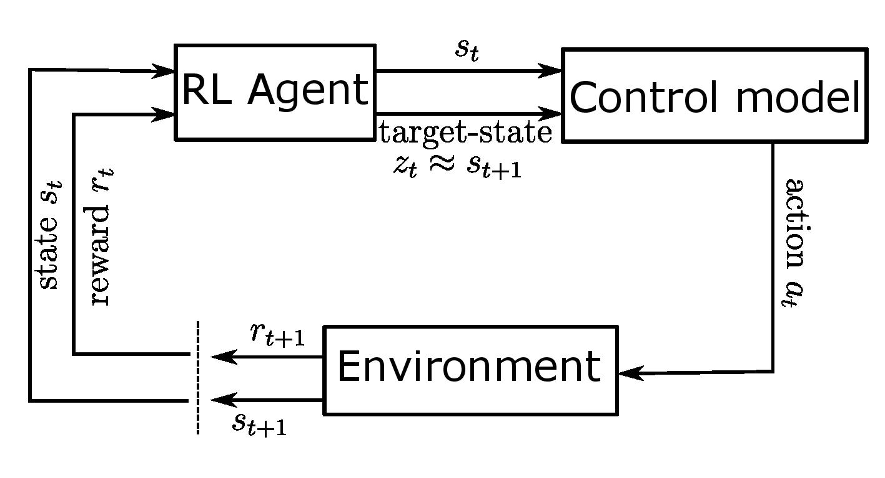

# Software and Results for the Paper Entitled  *State Planning Policy Reinforcement Learning*

This repository is the official implementation of the State Planning Policy Reinforcement Learning.  
Demo [video](https://youtu.be/dWnhNnX6f0g).



## Requirements

Code was run on Ubuntu 18.03 in anaconda environment, in case of another set-up, extra dependencies could be required.
To install requirements run:

```setup
pip install -r rltoolkit/requirements.txt
```

Requirements will install mujoco-py which will work only on installed mujoco with licence (see **Install MuJoCo** section in [mujoco-py documentation](https://github.com/openai/mujoco-py))

Then install `rltoolkit` with:
```rltoolkit install
pip install -e rltoolkit/
```

## Training

To train the models in the paper, you can use scripts from `train` folder.
For example, to train SPP-SAC on the hopper, simply run:

```train
python train/spp_sac_hopper.py
```

After running the script the folder with logs will appear. It will contain tensorboard logs of your runs and `basic_logs` folder. In `basic_logs` you can find 2 pickle files per experiment one with model and one with pickled returns history.

You can find hyperparameters used in our experiments either in paper appendix or `train` folder scripts.

take note of the `N_CORES` parameter within the training scripts, which 
should be set accordingly to the available CPU unit(s).

## Evaluation

Model evaluation code is available in the jupyter notebook: `notebooks/load_and_test.ipynb`.
There you can load pre-trained models, evaluate their reward, and render in the environment.


## Pre-trained Models

You can find pre-trained models in `models` directory and check how to load them in `load_and_test.ipynb` notebook.


## Results

Our model achieves the following performance on :

### [OpenAI gym MuJoCo environments](https://gym.openai.com/envs/#mujoco)

# TODO: plots with performance on different envs.

